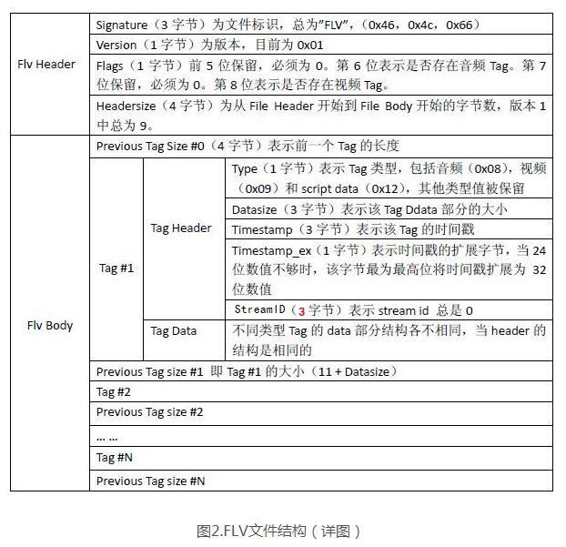

flv.js 中的demux就是一套 FLV 媒体数据格式的解析器。


**flv.js怎么用？**	下面进入正题，flv.js代码解读：demux部分

打开代码 [https://github.com/Bilibili/flv.js/blob/master/src/demux/flv-demuxer.js](https://github.com/Bilibili/flv.js/blob/master/src/demux/flv-demuxer.js?1.1.9)

```javascript
    static probe(buffer) {
        let data = new Uint8Array(buffer);
        let mismatch = {match: false};
        // 0x46 0x4c 0x56 这几个数字其实就是 'F' 'L' 'V' 的ascii码，表示flv文件头
        // 0x01是flv格式的版本号，用这来检测数据是不是 flv 格式。
        if (data[0] !== 0x46 || data[1] !== 0x4C || data[2] !== 0x56 || data[3] !== 0x01) {
            return mismatch;
        }

        ...

        let offset = ReadBig32(data, 5);

        if (offset < 9) {
            return mismatch;
        }

        return {
            match: true,
            consumed: offset,
            dataOffset: offset,
            hasAudioTrack: hasAudio,
            hasVideoTrack: hasVideo
        };
    }
```

0x46 0x4c 0x56 这几个数字其实就是 'F' 'L' 'V' 的ascii码，表示flv文件头，后面的0x01是flv格式的版本号，用这来检测数据是不是 flv 格式。

```javascript
// 取出第五个字节，它的第六 和 第八 bit 分别表示是否存在 音频和视频数据，其它位是保留位可以忽略。
// 4二进制为：00000100
// 1二进制位：00000001
let hasAudio = ((data[4] & 4) >>> 2) !== 0;
let hasVideo = (data[4] & 1) !== 0;
```

这个probe是被 parseChunks 调用的，当读取了至少13个字节后，就判断下是否是一个flv数据，然后再继续后面的分析。为什么是13，因为flv的文件头就是13个字节，参考 上面 PDF里的 “The FLV header”，这13个字节包括了后面的一个四字节的size，这个size表示前一个tag的大小，但是由于第一个tag是不存在前一个的，所以第一个size总是 0。取出第五个字节，它的第六 和 第八 bit 分别表示是否存在 音频和视频数据，其它位是保留位可以忽略。

parseChunks 后面的代码就是在不断解析 tag，flv把一段媒体数据称为 TAG，每个tag有不同的type，实际上真正用到的只有三种type，8、9、18 分别对应，音频、视频和Script Data。

```javascript
// 解析媒体tag，获取tag类型，只用到视频(0x08)、音频(0x09)、script data(0x12)，对应着十进制8， 9 ，18
if (tagType !== 8 && tagType !== 9 && tagType !== 18) {
         Log.w(this.TAG, `Unsupported tag type ${tagType}, skipped`);
        // consume the whole tag (skip it)
        offset += 11 + dataSize + 4;
        continue;
}
```

tag header的格式为：UI 表示 unsigned int，后面的是bit数。这段代码就在判断tag type，注意看 那个 数字 11，因为tag header是11个字节，后面就是tag body了，所以offset加上这些偏移是为了跳到下一个tag的位置。

```javascript
UI8 tag type
UI24 data size
UI24 timestamp
UI8 TimestampExtended
UI24 StreamID
```

你看是不是正好 11 个字节，adobe为了节约流量，能用24bit表示的绝不用32bit，但是还是给timestamp设置了一个 扩展位存放最高位的字节，这个设计很蛋疼，于是导致了下面这段奇葩代码，先取三个字节按照Big-Endian转换成整数再在高位放上第四个字节。

```javascript
let ts2 = v.getUint8(4);
let ts1 = v.getUint8(5);
let ts0 = v.getUint8(6);
let ts3 = v.getUint8(7);

// ts3: 7xxxxxxx 00000000 00000000 00000000
// ts2: 00000000 4xxxxxxx 00000000 00000000
// ts1: 00000000 00000000 5xxxxxxx 00000000
// ts0: 00000000 00000000 00000000 6xxxxxxx
let timestamp = ts0 | (ts1 << 8) | (ts2 << 16) | (ts3 << 24);
```

解析完了 tag header后面分别按照不同的 tag type调用不同的解析函数。

```javascript
switch (tagType) {
       case 8:  // Audio
              this._parseAudioData(chunk, dataOffset, dataSize, timestamp);
                    break;
       case 9:  // Video
              this._parseVideoData(chunk, dataOffset, dataSize, timestamp, byteStart + offset);
                    break;
      case 18:  // ScriptDataObject
              this._parseScriptData(chunk, dataOffset, dataSize);
                    break;
}
```

**TAG type：8 音频**

音频结构比较简单，AUDIODATA的第一个字节表示音频格式，其实基本都是 ACC 16bit 立体声 44.1kHz采样，所以最常见的数字就是 0xAF，后面一般就是 AACAUDIODATA了

**TAG type ： 9 视频**

重点看的是视频，

```javascript
let frameType = (spec & 240) >>> 4;

let codecId = spec & 15;
```

_parseAVCVideoPacket 用来解析 AVCVIDEOPACKET 结构，就是H.264的视频包这里取两个重要的值，frameType表示帧类型 1 是关键帧 2 是非关键帧，codeId是编码类型。虽然flv支持 六种视频格式，但是实际上互联网点播直播真正在用的基本只有H.264一种。所以codecId基本都是7。这里作者用了十进制的数，其实就是按位取值，用16进制的数会更好理解。

```javascript
let packetType = v.getUint8(0);

let cts = v.getUint32(0, !le) & 0x00FFFFFF;
```

这里有个坑，参考adobe的文档，这是CTS是个有符号的24位整数，SI24，就是说它有可能是个负数，所以我怀疑flv.js解析cts的代码有bug，没有处理负数情况。因为负数的24位整型到32位负数转换的时候要手工处理高位的符号位和补码问题。（我只是怀疑，没有调试确认过，但是我在处理YY直播数据的时候是踩过这个坑的，个别包含 B frame的视频是会出现CTS为负数的情况的）解释下 CTS的概念，CompositionTime，我们前面在tag header里拿到过一个 timestamp，这个在视频里对应于DTS，就是解码时间戳，而CTS实际上是一个offset，表示 PTS相对于DTS的偏移量，就是 PTS和DTS的差值。


packetType有两种，0 表示 AVCDecoderConfigurationRecord，这个是H.264的视频信息头，包含了 sps 和 pps，AVCDecoderConfigurationRecord的格式不是flv定义的，而是264标准定义的，如果用ffmpeg去解码，这个结构可以直接放到 codec的extradata里送给ffmpeg去解释。

flv.js作者选择了自己来解析这个数据结构，也是迫不得已，因为JS环境下没有ffmpeg，解析这个结构主要是为了提取 sps和pps。虽然理论上sps允许有多个，但其实一般就一个。

```javascript
let config = SPSParser.parseSPS(sps);
```

packetTtype 为 1 表示 NALU，NALU= network abstract layer unit，这是H.264的概念，网络抽象层数据单元，其实简单理解就是一帧视频数据。pps的信息没什么用，所以作者只实现了sps的分析器，说明作者下了很大功夫去学习264的标准，其中的Golomb解码还是挺复杂的，能解对不容易，我在PC和手机平台都是用ffmpeg去解析的。SPS里面包括了视频分辨率，帧率，profile level等视频重要信息。

NALU的头有两种标准，一种是用 00 00 00 01四个字节开头这叫 start code，另一个叫mp4风格以Big-endian的四字节size开头，flv用了后一种，而我们在H.264的裸流里常见的是前一种。

**TAG type ： 18 Script Data**

除了音视频数据外还有 ScriptData，这是一种类似二进制json的对象描述数据格式，JavaScript比较惨只能自己写实现，其它平台可以用 librtmp的代码去做。

我觉得作者处理解决flv播放问题外，也为前端贡献了 amf 解析，sps解析，Golomb解码等基础代码，这些是可以用在其他项目里的。

在用传输协议获取了flv数据流后，用demux分离出音视频数据的属性和数据包，这为后面的播放打下了基础，从demux入手去读代码是个不错的切入点，而且一定要配合 flv file format spec一起看，反复多看几遍争取熟记在心。